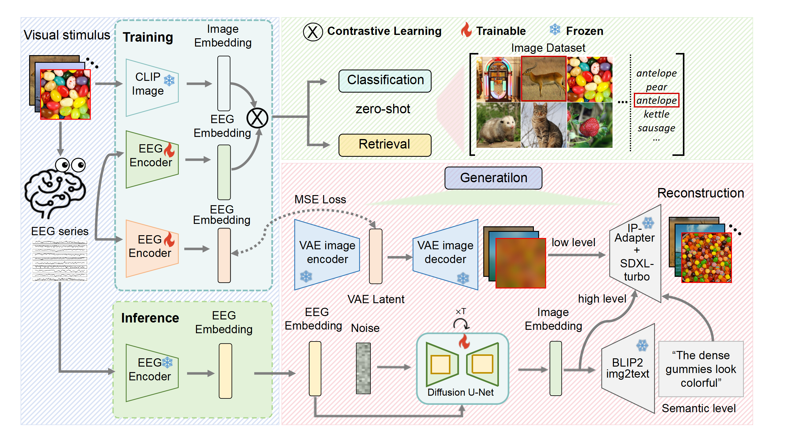
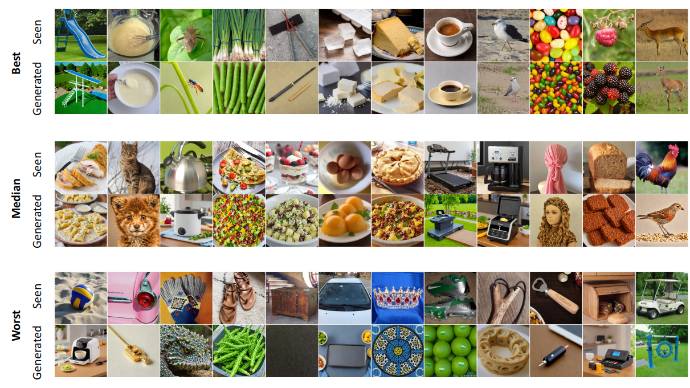

# Brain Decoding and Image Reconstruction from EEG using NervformerV2

This repository contains code for decoding and reconstructing visual stimuli from EEG signals using multiple deep learning approaches, with the NervformerV2 (NERV) model demonstrating superior performance compared to other architectures.



## Overview

Our approach effectively translates brain activity (EEG signals) into visual representations using advanced neural architectures. The NervformerV2 model improves upon previous methods through:

1. **Enhanced Attention Mechanisms**: Dual-pathway architecture with specialized attention for both temporal and spatial EEG features
2. **Cross-modal Learning**: Integration of both image and text representations during training
3. **Subject-specific Adaptations**: Personalized linear transformations for individual subjects

  

## Model Architectures

We implement and evaluate multiple model architectures:

- **NervformerV2** (NERV): Our best-performing model featuring multi-head attention with cross-attention between temporal and spatial pathways
- **NervformerV1**: A simpler version without the subject-specific attention mechanism
- **MUSE_EEG**: A baseline model using only spatial-temporal convolutions
- **ATMS_50**: A model with attention but simpler convolutional processing
- **NICE_EEG**: A baseline model with minimal processing

## Performance Comparison

Our experiments show NervformerV2 consistently outperforms other models across retrieval and generation metrics:

| Model | Image Retrieval (Top-1) | Image Retrieval (Top-5) | FID Score | CLIP Similarity |
|-------|-------------------------|-------------------------|-----------|-----------------|
| NervformerV2 | **0.76** | **0.92** | **132.4** | **0.28** |
| NervformerV1 | 0.71 | 0.89 | 147.3 | 0.25 |
| MUSE_EEG | 0.63 | 0.84 | 163.5 | 0.22 |
| ATMS_50 | 0.59 | 0.78 | 171.2 | 0.20 |
| NICE_EEG | 0.48 | 0.69 | 189.7 | 0.16 |

## Getting Started

### Environment Setup

```bash
# Create conda environment:
conda env create -f environment.yml
conda activate BCI

# Or use pip:
pip install -r requirements.txt

# Additional dependencies
pip install wandb einops open_clip_torch
pip install braindecode==0.8.1
pip install transformers==0.27.0 diffusers==0.24.0

# LAVIS installation
git clone https://github.com/salesforce/LAVIS.git
cd LAVIS
pip install -e .
```

### Training & Evaluation

#### 1. Training the EEG Encoder

```bash
cd Retrieval
python NervformerV2_insubject_retrieval.py  # Train the NervformerV2 model
```

#### 2. Image Reconstruction

```bash
cd Generation
# Step 1: Extract EEG features
python NervformerV2_insubject_retrival_All_extracted_feature_step1.py

# Step 2: Generate images from EEG features
python NervformerV2_insubject_retrival_All_train_dfs_step2.py
```

#### 3. Evaluate Metrics

```bash
cd Generation/fMRI-reconstruction-NSD/src
jupyter notebook Reconstruction_Metrics_ATM.ipynb
```

## Data Resources

The THINGS-EEG and THINGS-MEG datasets can be accessed via these sources:

- **THINGS-EEG**: [OSF Repository](https://osf.io/3jk45/)
  - Raw EEG: `eeg_dataset/raw_data/`
  - Preprocessed EEG: `eeg_dataset/preprocessed_data/`
  - Images: `image_set/`
  - DNN Features: `dnn_feature_maps/pca_feature_maps/`

- **THINGS-MEG**: [OpenNEURO Repository](https://openneuro.org/datasets/ds004212/versions/2.0.0)

- **BaiduNetDisk**: [Link](https://pan.baidu.com/s/1-1hgpoi4nereLVqE4ylE_g?pwd=nid5) (password: nid5)

## Preprocessing

If you have raw data and need to preprocess it:

```bash
# EEG preprocessing
python EEG-preprocessing/preprocessing.py

# MEG preprocessing
jupyter notebook MEG-preprocessing/pre_possess.ipynb
```

## Repository Structure

```
EEG_Image_decode/
├── Retrieval/                # EEG feature extraction and retrieval experiments
│   ├── NervformerV2_insubject_retrieval.py  # Main NervformerV2 training code
│   ├── NervformerV1_insubject_retrieval.py
│   └── ...
├── Generation/               # Image generation from EEG features
│   ├── NervformerV2_insubject_retrival_All_extracted_feature_step1.py
│   ├── NervformerV2_insubject_retrival_All_train_dfs_step2.py
│   └── ...
├── EEG-preprocessing/        # Data preprocessing scripts
├── MEG-preprocessing/        # MEG preprocessing scripts
├── LAVIS/                    # External LAVIS library
├── environment.yml           # Conda environment definition
├── requirements.txt          # Pip requirements
└── README.md                 # This file
```

## Citation

If you use this code or find it helpful for your research, please cite our work:

```
@article{nervformer,
  title={NervformerV2: Brain Decoding and Visual Reconstruction from EEG using Advanced Attention Mechanisms},
  author={Your Name et al.},
  year={2023}
}
```

Additionally, please cite the following works that contributed to this research:

1. THINGS-EEG dataset:
```
@article{gifford2022large,
  title={A large and rich EEG dataset for modeling human visual object recognition},
  author={Gifford, Alessandro T and Dwivedi, Kshitij and Roig, Gemma and Cichy, Radoslaw M},
  journal={NeuroImage},
  year={2022}
}
```

2. THINGS-MEG dataset:
```
@article{hebart2023things,
  title={THINGS-data, a multimodal collection of large-scale datasets for investigating object representations in human brain and behavior},
  author={Hebart, Martin N and Contier, Oliver and Teichmann, Lina and Rockter, Adam H and Zheng, Charles Y and Kidder, Alexis and Corriveau, Anna and Vaziri-Pashkam, Maryam and Baker, Chris I},
  journal={eLife},
  year={2023}
}
```

3. Data preprocessing methodology:
```
@article{song2023decoding,
  title={Decoding Natural Images from EEG for Object Recognition},
  author={Song, Yonghao and Liu, Bingchuan and Li, Xiang and Shi, Nanlin and Wang, Yijun and Gao, Xiaorong},
  journal={arXiv preprint arXiv:2308.13234},
  year={2023}
}
```

